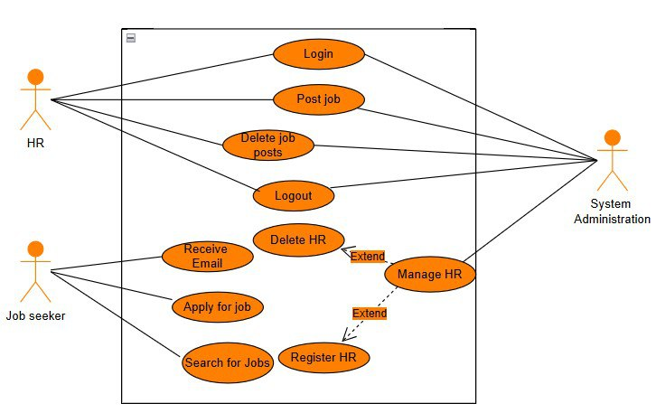

# Employment Vacancy Web App


A web application developed during my internship at the **Ministry of Innovation and Technology (MINT)** to help job seekers easily access and apply for job opportunities.

## 🔹 Features  
- View job announcements without requiring an account.  
- Simple and intuitive UI for job seekers.  
- Backend powered by **MySQL** for data storage.  
- Developed following the **Waterfall methodology**.  

## 📌 Tech Stack  
- **Frontend:** HTML, CSS, React, SCSS  
- **Backend:** Node.js  
- **Database:** MySQL  

## 📌 System Design  
  

## 🚀 Get Started  

1. Clone the repository:  
   ```sh
   git clone https://github.com/Esam-jr/MINT-Vacancy
