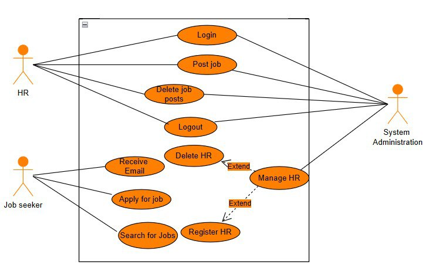

## Mint Vacancy

### Overview

Mint Vacancy is a full‑stack recruitment portal for the Ministry of Innovation and Technology. It provides:

- A public site for applicants to browse announcements and apply to vacancies
- An admin dashboard for staff to manage announcements, vacancies, applications, and administrators

The backend is a Node.js/Express API with a SQL database and file uploads (CVs and supporting documents). The admin dashboard is a React (Vite) app. The public site is a lightweight static site with vanilla JS.

### Monorepo structure

```
MINT-Vacancy/
  client/                # Public site (static HTML/CSS/JS)
    index.html
    src/
    public/
    package.json

    MinT-Admin/          # Admin dashboard (React + Vite)
      src/
      public/
      package.json
      vite.config.js

  server/                # Node.js + Express API
    app.js
    database/
      employee_vacancy.sql   # DB schema and seed
    uploads/                 # User-uploaded files (ignored by git)
    package.json
```

### Features

- **Announcements**: Create and publish announcements
- **Vacancy Management**: Create, edit, and archive vacancies
- **Applications**: Applicants submit forms and upload documents; admins review and filter
- **Admin Users**: Authentication for admin users
- **File Uploads**: Secure storage of applicant files

### Tech stack

- **Frontend (Public)**: HTML, CSS, vanilla JS
- **Frontend (Admin)**: React, Vite, ESLint
- **Backend**: Node.js, Express
- **Database**: SQL (import schema from `server/database/employee_vacancy.sql`)
- **Uploads**: Stored under `server/uploads/`

### Prerequisites

- Node.js 18+
- npm 9+ (or pnpm/yarn)
- A SQL database (e.g., MySQL 8+)

### Quick start

1. Clone and open the project

```
git clone <your-repo-url>
cd MINT-Vacancy
```

2. Install dependencies

```
# Backend
cd server && npm install

# Public site (optional; used if you want a dev server)
cd ../client && npm install

# Admin dashboard
cd ./MinT-Admin && npm install
```

3. Configure environment (backend)

- Copy `server/.env.example` to `server/.env` and fill values
- Create the database and import `server/database/employee_vacancy.sql`

```
# Example (MySQL)
mysql -u <user> -p < database_name < server/database/employee_vacancy.sql
```

4. Run the apps

```
# Start API server
cd server
npm run dev   # or: npm start

# Start Admin dashboard (Vite)
cd ../client/MinT-Admin
npm run dev

# Public site
# Option A: open client/index.html with a static server or your editor's Live Server
# Option B: if a script exists, run it, e.g.: npm run dev (in client/)
```

### Environment variables (server/.env)

Copy `server/.env.example` to `server/.env` and adjust:

```
NODE_ENV=development
PORT=5000

# Database (MySQL example)
DB_HOST=localhost
DB_PORT=3306
DB_USER=root
DB_PASSWORD=your_password
DB_NAME=mint_vacancy

# CORS
CORS_ORIGIN=http://localhost:5173

# Uploads
UPLOAD_DIR=uploads
MAX_FILE_SIZE_MB=10

# Security
SESSION_SECRET=change_me
```

### Database

- Import schema from `server/database/employee_vacancy.sql`
- Set credentials in `server/.env`

### Project notes

- `server/uploads/` is ignored by git to keep the repo clean
- Ensure your admin app and public site use the correct API base URL (often `http://localhost:5000` during development)
- If ports differ from the defaults above, update `CORS_ORIGIN` accordingly

### Scripts (common)

- Backend: `npm run dev` or `npm start`
- Admin (Vite): `npm run dev` to run locally, `npm run build` to produce a production build

### Troubleshooting

- If file uploads fail, verify `UPLOAD_DIR` exists (`server/uploads/`) and your process has write permission
- If requests are blocked, check CORS settings (`CORS_ORIGIN`) and dev server ports
- Verify the DB connection details and that the schema is imported

### Visuals

- **Landing page**:

  

- **Use case diagram**:

  

### License

This repository is provided as-is. If you require a specific license, add a `LICENSE` file accordingly.

